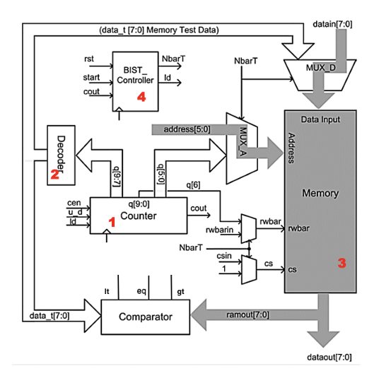
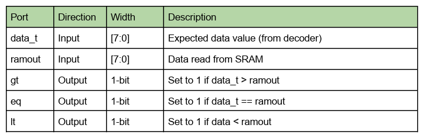
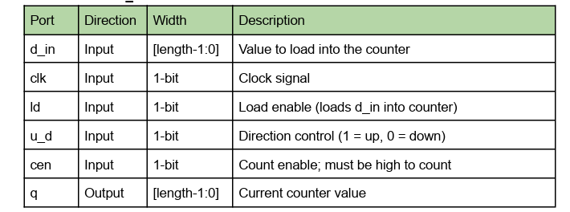

# dvl2013_mbist
MBIST Implementation for NYU VLSI Architecture Course 

## Overview
Design and verify a complete MBIST (Memory Built-In Self-Test) system for a 64 x 8-bit SRAM using SystemVerilog. The project involves implementing individual submodules such as controller, decoder, counter, mulitplexer, and memory. Detailed description of each submodule and their integration is illustrated in the architecture

### Comparator 
1. The comparator module is used within the BIST system to compare two 8-bit values. 
    a. The expected data pattern (data_t) generated by the decoder 
    b. Actual data read from SRAM (ramout)
It outputs comparison flags indicating whether the actual memory data matches, is greater than, or less than the expected value. This comparison result is used to detect memory faults during test algorithms

### Counter
1. The Counter module is a configurable, general purpose synchronous counter used in the BIST system to generate: 
    a. Sequential memory addresses
    b. Timing control for BIST sequences
    c. Pattern selection bits for the decoder module
    d. Supports up-counting, down-counting, load functionality, and carry out detection
2. Parameterize the module using a parameter named length with a default value of 10
3. On each positive edge, check if cen is high then:
    a. If ld is high -> counter is loaded with d_in
    b. Else if u_d = 1 -> counter increments, else it will decrement

